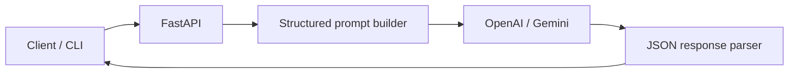

# GenAI Code Reviewer & AI Assistant

Portfolio implementation of a **Generative AI code review** system: send Python (or any) source code and receive structured feedback — bugs, style issues, security hints, and improvement suggestions — via **OpenAI** or **Google Gemini** APIs.

Aligned with production experience building LLM apps with **FastAPI**, structured prompts, and optional **AWS Bedrock** deployment patterns.

[](https://www.python.org/)
[](https://fastapi.tiangolo.com/)
[](https://platform.openai.com/)
[](https://ai.google.dev/)

---

## Features

- **Dual provider support** — `openai` or `gemini` (switch via env)
- **Structured review JSON** — summary, issues[], severity, suggested_fix
- **REST API** — FastAPI `/review` endpoint
- **CLI** — review a file from terminal without running the server
- **Safe defaults** — API keys only from environment; no secrets in repo

---

## Architecture



---

## Quick start

```bash
git clone https://github.com/NikhilAkula4511/nikhil-genai-code-reviewer.git
cd nikhil-genai-code-reviewer
python -m venv .venv && source .venv/bin/activate
pip install -r requirements.txt
cp .env.example .env   # add your API keys
```

### CLI review

```bash
python -m src.cli --file examples/sample_buggy.py --provider openai
```

### API server

```bash
uvicorn src.api:app --reload --port 8000
```

```bash
curl -X POST http://localhost:8000/review \
  -H "Content-Type: application/json" \
  -d '{"code": "def add(a,b):\n return a+b", "language": "python", "provider": "openai"}'
```

---

## Environment variables

| Variable | Description |
|----------|-------------|
| `OPENAI_API_KEY` | OpenAI API key |
| `GEMINI_API_KEY` | Google AI Studio / Gemini key |
| `DEFAULT_PROVIDER` | `openai` or `gemini` |

---

## Example output

```json
{
  "summary": "Function works but lacks type hints and input validation.",
  "issues": [
    {"severity": "low", "line": 1, "message": "Missing docstring"},
    {"severity": "medium", "line": 2, "message": "No type hints on parameters"}
  ],
  "suggested_improvements": ["Add type hints", "Validate numeric inputs"]
}
```

---

## Production notes (from experience)

- Use **structured outputs** / JSON schema where supported — improves parse reliability (~95% quality lift vs free-form text in internal evals)
- Rate-limit and cache repeated reviews per file hash
- For AWS: swap provider module with **Bedrock** `invoke_model` (Claude / Titan) — same FastAPI surface

---

## Author

**AKULA NIKHIL** — AIML Engineer  
[nikhilakularohith@gmail.com](mailto:nikhilakularohith@gmail.com) · [LinkedIn](https://www.linkedin.com/in/akula-nikhil/)

---

## License

MIT — see [LICENSE](LICENSE).
